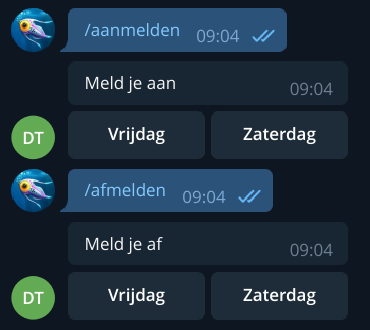

# DJO aanmeldbot

<p align="center">
    
</p>

Made using [idp-renew](https://github.com/wipeautcrafter/idp-renew) and [python-telegram-bot](https://github.com/python-telegram-bot/python-telegram-bot)
## Installation
Create a bot using [BotFather](https://t.me/BotFather) and copy the token.
Add commands to the bot using `/setcommands`.
Use the following commands:
```
help - Help
start - Help
aanmelden - Aanmelden voor de DJO
afmelden - Afmelden voor de DJO
login - Op de bot inloggen
logout - Op de bot uitloggen
```

Create a virtual environment and install the requirements:
```bash
python3 -m venv venv
source venv/bin/activate
pip install -r requirements.txt
```

Set your bot token environment variable:
```bash
export BOT_TOKEN=your_bot_token
```
You can append it to your venv/bin/activate file to make it persistent.


Then run the bot:
```bash
$ python3 main.py
```